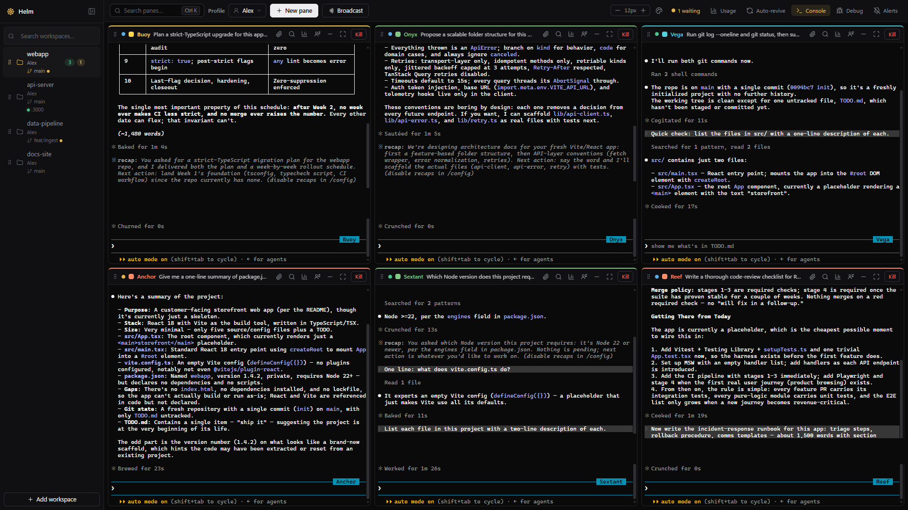

<div align="center">

# Helm ⎈

**A local operations hub for Claude Code** — run a fleet of real `claude`
terminal sessions in one browser grid, see who's working / waiting / idle at
a glance, and never lose a session to a closed tab.

[](https://github.com/VenJami/Helm/actions/workflows/ci.yml)
[](CHANGELOG.md)
[](LICENSE)
[](https://nodejs.org)



*Six real Claude Code sessions across four projects. Green dot = working,
amber = waiting for you, grey = idle — plus each project's git branch, dirty
state, and dev-server status in the sidebar.*

</div>

## Why Helm?

Running one Claude Code session is easy. Running six across three projects is
alt-tab hell: which one is stuck on a permission prompt? Which one finished
20 minutes ago? How many tokens did that refactor burn?

- **Everything on one screen.** Every pane is a real `claude` CLI session
  (node-pty + xterm.js), grouped by project. Status badges are driven by
  Claude Code's own hook events — not output scraping — so "waiting" means
  Claude actually asked for something, and a desktop notification tells you
  why.
- **Your subscription, not an API bill.** Helm spawns the `claude` CLI you
  already pay for. No API keys, no per-token billing, no custom agent loop —
  the panes *are* Claude Code.
- **Sessions outlive everything.** Closing the tab or refreshing never kills
  a session — panes repaint from a replay buffer. After a server restart,
  one click revives the same conversation (`claude --resume`), or auto-revive
  brings it back for you.

## Quick start

You need **Node.js 22+** and **[Claude Code](https://claude.com/claude-code)**
installed and logged in (`claude` must work in a terminal on its own).
**Windows** is the tested platform; macOS/Linux are supported in code but not
yet verified on real hardware — reports welcome.

```bash
git clone https://github.com/VenJami/Helm.git && cd Helm
cd server && npm install
cd ../web  && npm install && npm run build
cd ../server && npm start        # → http://127.0.0.1:7777
```

Open http://127.0.0.1:7777, add a project folder as a workspace, and hit
**New pane**. Set the `PORT` environment variable to change the port. On
Windows, `start-helm.cmd` (repo root) starts the server in its own console
window instead.

> `node-pty` is a native module. If `npm install` fails in `server/`, you may
> need the standard Windows build tools (Visual Studio Build Tools + Python).

## Features

- **Live terminal grid** — real Claude Code sessions grouped by workspace:
  drag panes to reorder, drag the gutters to resize (persists per workspace),
  maximize one, or minimize to a tray pill while it keeps running.
- **Status at a glance** — working / waiting / idle badges with elapsed time
  ("working 45m" = maybe check on it), a toolbar pill that jumps to the next
  blocked pane, desktop notifications with the reason ("Claude needs
  permission to…"), and a "(N waiting)" tab title.
- **Durable sessions** — reloads never kill panes; killed servers leave every
  pane revivable with the same conversation; exited sessions stick around
  until you dismiss them.
- **Panes title themselves** — each pane is auto-named from what it's working
  on, and the Ctrl/Cmd+K palette finds any pane or workspace by name or task.
- **Usage & cost** — tokens per pane and per account over rolling windows
  (1 h → 30 d + all-time), split by model, with rough $ estimates from
  published prices. All computed locally from Claude Code's own transcripts.
- **Multi-account** — run panes on different Claude subscriptions side by
  side via isolated profiles, pin a default account per workspace, or move a
  live pane to another account without losing the conversation
  ([docs/ACCOUNTS.md](docs/ACCOUNTS.md)).
- **Broadcast & attachments** — send one instruction to many panes ("commit
  your work, then summarize"); paste or drop images/files into a pane and
  Claude reads them from disk, like native terminal drag-drop.
- **Workspace ops** — the sidebar shows each project's git branch, dirty
  marker, ahead/behind counts, and whether its dev server is up on its port.
- **Make it yours** — dark or light theme with five accent presets, terminal
  font-size stepper, pane names & colors, PWA install (native-app feel, no
  Electron). Terminals stay dark in light mode so Claude's TUI stays legible.

**Keyboard:** Ctrl/Cmd+K palette · Ctrl+Shift+F find in scrollback ·
Ctrl+Shift+M maximize · Ctrl+Shift+←/→ cycle panes.

## How it works

```
Browser (React + xterm.js grid) <--WS/REST--> Node server <--PTY--> claude.cmd
                                                   ^ hook relay POSTs (status)
```

- REST creates and kills sessions; WebSockets only *attach*. Closing the tab
  never kills a PTY — sessions outlive sockets by design.
- Each pane is spawned with `--settings` pointing at a generated hook config,
  so Claude Code's own hook events (SessionStart / UserPromptSubmit / Stop /
  Notification) are relayed back to Helm. That powers the status badges,
  revive, and usage — no output scraping, and no profile's settings.json is
  ever modified.
- No database: state is a few JSON files under `%LOCALAPPDATA%\Helm`
  (`~/.helm` on macOS/Linux), written atomically with backup recovery.
- Helm necessarily parses some undocumented `claude` on-disk formats. When a
  Claude Code update shifts them, Helm shows a loud warning banner instead of
  silently zeroing your usage or breaking revive
  ([docs/CLAUDE_INTERNALS.md](docs/CLAUDE_INTERNALS.md)).

Details in [docs/ARCHITECTURE.md](docs/ARCHITECTURE.md).

## Security model

A terminal server without auth would let any webpage you visit run commands
on your machine. Helm's defenses:

- The server binds to **127.0.0.1 only** — nothing is exposed to your network.
- Every REST and WebSocket call requires a **bearer token**, generated on
  first run and injected into the page by the server. WebSocket upgrades also
  check the **Origin** header, and token compares are constant-time.
- Tokens, session state, and account profiles live in `%LOCALAPPDATA%\Helm`,
  never in this repo.
- Everything runs locally — no cloud services, no telemetry, $0.

Full threat model, what's out of scope (multi-user/remote is **not**
supported), and how to report a vulnerability: [SECURITY.md](SECURITY.md).

## FAQ

**Does Helm use my Anthropic API key?**
No. Panes run the official `claude` CLI under the login you already have —
Pro/Max subscription or whatever your CLI uses. Helm itself never calls the
Anthropic API and has no key to leak.

**Is my code or conversation sent anywhere?**
No. One local Node server on loopback; state stays in `%LOCALAPPDATA%\Helm`.
No cloud, no telemetry.

**The browser crashed / I closed the tab mid-task. Did I lose the session?**
No — sessions live on the server, and the pane repaints from a replay buffer
when you come back. If the *server* stops, panes return as revivable and
resume the same conversation.

**Can different panes use different Claude accounts?**
Yes — isolated profiles with their own logins, a per-workspace default
account, and per-account usage roll-ups. You can move a running pane between
accounts and keep the chat. See [docs/ACCOUNTS.md](docs/ACCOUNTS.md).

**Can I reach Helm from my phone or another machine?**
Not today — remote access is explicitly out of scope of the current security
model ([SECURITY.md](SECURITY.md)). A Tailscale-based story is on the
long-term list.

## Docs

- [docs/ARCHITECTURE.md](docs/ARCHITECTURE.md) — API, spawn details, hook relay
- [docs/ACCOUNTS.md](docs/ACCOUNTS.md) — multi-account profiles
- [docs/GOTCHAS.md](docs/GOTCHAS.md) — known traps (read before touching server code)
- [docs/CLAUDE_INTERNALS.md](docs/CLAUDE_INTERNALS.md) — the `claude` internals Helm depends on
- [docs/ROADMAP.md](docs/ROADMAP.md) — done + planned
- [CHANGELOG.md](CHANGELOG.md) — release notes
- [CLAUDE.md](CLAUDE.md) — working agreement for Claude Code sessions on this repo

## Contributing

Issues and PRs welcome — see [CONTRIBUTING.md](CONTRIBUTING.md) for dev setup,
the pre-PR checklist, and the project's simplicity/security ground rules.
Security vulnerabilities: please report privately per [SECURITY.md](SECURITY.md).

## License

[MIT](LICENSE)
